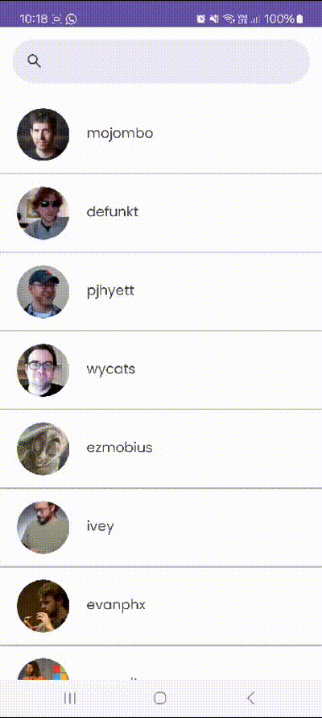

[![Contributors][contributors-shield]][contributors-url]
[![Forks][forks-shield]][forks-url]
[![Stargazers][stars-shield]][stars-url]
[![Issues][issues-shield]][issues-url]

 

<h1>Github User App</h1>
  
 
     
    <a href="https://github.com/allandrp/GithubUserApp">View Demo</a>
    ·
    <a href="https://github.com/allandrp/GithubUserApp/issues">Report Bug</a>
    ·
    <a href="https://github.com/allandrp/GithubUserApp/issues">Request Feature</a>
     
     

  
  # Application Demo
   

     
     
  

# About

Aplikasi untuk menampilkan user github dengan memanfaatkan API github didalamnya. Terdapat beberapa fitur didalamnya yaitu menampilkan list user github, mencari user github spesifik dan menampilkan followers dan following dari user github

# External Library
<ol>
  <li>Retrofit2</li>
  <li>Glide</li>
  <li>OkHttp3</li>
</ol>

<!-- MARKDOWN LINKS & IMAGES -->
<!-- https://www.markdownguide.org/basic-syntax/#reference-style-links -->
[contributors-shield]: https://img.shields.io/github/contributors/allandrp/GithubUserApp.svg?style=for-the-badge
[contributors-url]: https://github.com/allandrp/GithubUserApp/graphs/contributors
[forks-shield]: https://img.shields.io/github/forks/allandrp/GithubUserApp.svg?style=for-the-badge
[forks-url]: https://github.com/allandrp/GithubUserApp/network/members
[stars-shield]: https://img.shields.io/github/stars/allandrp/GithubUserApp.svg?style=for-the-badge
[stars-url]: https://github.com/allandrp/GithubUserApp/stargazers
[issues-shield]: https://img.shields.io/github/issues/allandrp/GithubUserApp.svg?style=for-the-badge
[issues-url]: https://github.com/allandrp/GithubUserApp/issues
